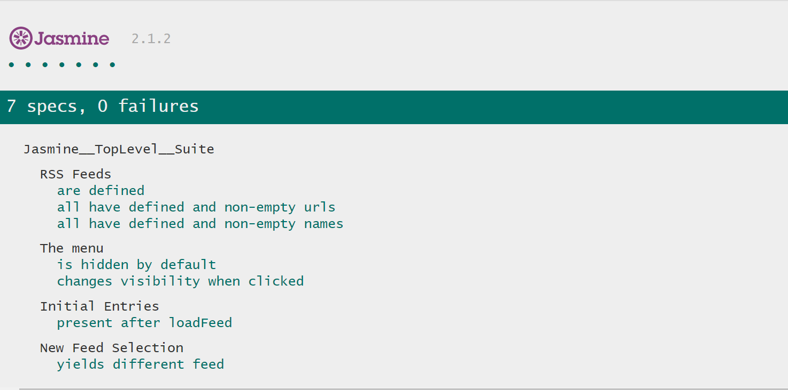

# The Jasmine Library For A Feed Reader Application

This is a web-based application developed by Udacity which reads RSS feeds. As an exercise in writing tests using the [Jasmine](http://jasmine.github.io/) library, I have added some tests to exam simple functionality involving the loaded feeds and the menu.

### Running The Application

To run the application, you can clone the repository using the following terminal command:
```
git clone https://github.com/wbchristerson/feed-reader.git
```
Alternatively, you can follow the below instructions to download to a hard drive:
* Click the green "Clone or download" button above then choose "Download ZIP".
* Find the folder feed-reader-master in your Downloads folder or wherever it was placed on your device.
* Right click and choose "Extract All".
* Open your browser and use Ctrl + O (for Windows machines) to open the file selector on your device.
* Go to feed-reader-master, enter feed-reader-master again, then select index.html. The page will appear. Notice the Jasmine specifications at the bottom of the page.
<p align="center">
  
</p>
